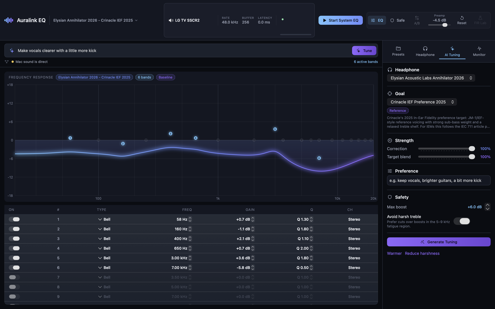

# Auralink EQ

> **0.1.0-alpha · source preview.** The source is open for development and
> evaluation. No official signed or notarized app binaries are distributed yet;
> build locally and expect interfaces to change before 1.0.

**Auralink EQ** is a macOS menubar app that puts a 20-band parametric equalizer
on your *system-wide* sound, plus a local **MCP server** so an AI assistant
(Claude / ChatGPT) can read the live audio state and generate, validate, and
apply per-headphone tunings in natural language.

It is a native **Swift / SwiftUI + AVFoundation** application. Audio is routed
the BlackHole way: the app captures the system mix from a virtual loopback
device, runs it through the EQ DSP, and plays it out to your real output device
(your headphones or DAC).

> Tell Claude *"make my HD600 punchier for rock but keep vocals clear and avoid
> harsh treble"* and it builds a safe, validated preset — then asks before
> touching your live audio.



---

## Why

macOS has no system-wide EQ. Per-app equalizers don't help YouTube, games, and
calls all at once, and they don't know anything about your specific headphones.
Auralink EQ fixes both: one global EQ for everything, and a knowledge layer of
headphone profiles + target curves that an AI can reason over.

**Auralink ships no headphone database.** The profiles and presets belong to you and
live in a collection directory of your own — see
[docs/DATA_COLLECTION.md](docs/DATA_COLLECTION.md). A fresh install has an empty
headphone list on purpose; name a model and the MCP layer fetches a public AutoEq
measurement for it on demand. Bundling one person's measurements and taste would
present them as factory truth, and they aren't.

---

## Architecture

Two layers. `AuralinkCore` is pure, hardware-free logic (fully unit-tested);
`AuralinkApp` is the SwiftUI shell, the AVFoundation audio engine, and the HTTP
control surface. The MCP server is a separate Node process that talks to the
app over an authenticated loopback connection and shares the same on-disk
preset/knowledge data.

```
                          ┌──────────────────────────────────────────┐
   Claude / ChatGPT  ───► │  mcp-server (Node + TypeScript, stdio)    │
   (natural language)     │  tools · resources · prompts              │
                          └───────────────┬──────────────────────────┘
                                          │ authenticated HTTP 127.0.0.1:8765
                                          │ + shared JSON files (presets, knowledge)
                                          ▼
   ┌─────────────────────────── AuralinkApp (menubar) ───────────────────────────┐
   │                                                                              │
   │   Views (SwiftUI)            Control                Audio                    │
   │   ┌───────────────┐   ┌──────────────────┐   ┌────────────────────────┐     │
   │   │ MenuBarView   │   │ ControlServer    │   │ AudioRoutingEngine     │     │
   │   │ EditorWindow  │◄─►│ (NWListener HTTP)│◄─►│ AudioDeviceManager     │     │
   │   │ EQGraphView   │   └──────────────────┘   │ AudioTelemetry         │     │
   │   │ AITuningPanel │            ▲             └───────────┬────────────┘     │
   │   └───────┬───────┘            │                         │                  │
   │           │            ┌───────┴────────┐                │                  │
   │           └───────────►│   AppModel     │◄───────────────┘                  │
   │                        │ (@MainActor)   │                                   │
   │                        └───────┬────────┘                                   │
   └────────────────────────────────┼─────────────────────────────────────────-─┘
                                     │  imports
                                     ▼
   ┌────────────────────────── AuralinkCore (pure logic) ────────────────────────┐
   │                                                                              │
   │   Models/        EQBand · EQPreset · HeadphoneProfile · TargetCurve ·        │
   │                  SafetyRules · AudioState · Validation · Analysis · AITuning  │
   │   DSP/           Biquad · EQProcessor · FrequencyResponse · TruePeakEstimator │
   │                  MeasuredFIRDesigner · PartitionedFIRConvolver                 │
   │   Presets/       PresetStore · PresetValidator                                │
   │   Knowledge/     KnowledgeBase · TuningEngine · CollectionManifest            │
   │   Resources/data target-curves.json · safety-rules.json                       │
   │                  (no headphone data — that lives in your collection)          │
   └──────────────────────────────────────────────────────────────────────────-─┘

   Signal path:  System audio ─► [BlackHole virtual device] ─► capture
                 ─► EQProcessor ─► selected output ─► 🎧
                    Standard: preamp + full 20-band IIR
                    Measured: preamp + measured minimum-phase FIR + preference IIR
```

**Key design points**

- **Pure core.** All EQ math, preset I/O, validation, and the deterministic
  tuning "engine" live in `AuralinkCore` with no UI or audio-hardware deps, so
  they are testable and reusable by the MCP server's mirrored validation.
- **Deterministic AI heuristic.** `TuningEngine` turns a headphone profile + a
  target curve + free-text preferences into a validated preset with no
  randomness — the same request always yields the same preset.
- **Safety first.** Every generated/edited preset runs through `PresetValidator`,
  which estimates the active renderer's response peak, computes an auto pre-amp
  to preserve headroom, and flags clipping risk. Measured FIR is enabled only
  when its persisted dense curve is valid and its sample-rate-specific design
  beats the PEQ fallback while meeting strict response-error gates. Writes that
  touch live audio respect the configured permission mode.
- **AI never surprises you.** The MCP `apply_eq_preset` / `rollback_preset`
  tools are annotated destructive and honor the app's permission mode
  (read-only → ask-before-write → allow-creation → full-control). Responses
  separate request acceptance from audible state: `audible:true` requires the
  expected preset and DSP generation to be callback-committed while routing is
  active, system output is routed through Auralink, and EQ is enabled.
- **Local control is capability-protected.** The app creates a user-only bearer
  token in Application Support. The MCP server reads it directly; browser-origin
  requests and unauthenticated calls are rejected.

---

## Repo layout

```
Sources/
  AuralinkCore/                 Pure logic, unit-tested.
    Models/                     Data contract (EQBand, EQPreset, …).
    DSP/                        Biquad, EQProcessor, FrequencyResponse.
    Presets/                    PresetStore, PresetValidator.
    Knowledge/                  KnowledgeBase, TuningEngine, CollectionManifest.
    Resources/data/             Bundled target-curve / safety JSON (no headphone data).
    AuralinkPaths.swift         Canonical on-disk locations.
    ControlAuthorization.swift  Local ControlServer capability management.
  AuralinkRT/                   C11 lock-free ring, meters, and DSP-state retirement queue.
  AuralinkApp/                  The menubar app.
    AuralinkApp.swift           @main: MenuBarExtra + editor Window.
    AppModel.swift              @MainActor state/init hub.
    AppModel/                   Domain extensions (bootstrap, routing, recovery,
                                output selection, tuning, setup, UI publish gate).
    Audio/                      AudioRoutingEngine, AudioDeviceManager, telemetry.
    Control/                    ControlServer (localhost HTTP for the MCP server).
    Views/                      MenuBar, editor, EQ graph, panels, design system.
Tests/AuralinkCoreTests/        DSP, preset, and tuning unit tests.
mcp-server/                     Node + TypeScript MCP server (+ data/ copy).
.pi/extensions/auralink-mcp.ts  Project-local Pi bridge for the MCP server.
scripts/bundle-app.sh           Build + assemble the runnable .app.
scripts/migrate-collection.mjs  One-time move into a user-owned collection.
docs/                           BUILD_SPEC.md (interface contract), SETUP.md,
                                DATA_COLLECTION.md (your headphone data).
README.md                       This file.
```

Two roots, with different owners — see `AuralinkPaths.swift`:

- `~/Library/Application Support/Auralink` is machine-local app state: the working
  `presets/`, `revisions/`, seeded `data/`, and a private `control-token`. Never copy
  the control token into an issue or config file.
- `~/auralink-collection` (override with `AURALINK_COLLECTION_DIR`) is **your**
  headphone profiles and curated presets. Auralink never ships content here and only
  writes to it when you ask. It is meant to be a git repository you own — see
  [docs/DATA_COLLECTION.md](docs/DATA_COLLECTION.md).

---

## Build · Test · Bundle · Run

Requirements: macOS 14+, Xcode command-line tools (Swift 6 toolchain),
and Node 18+ for the MCP server.

```bash
# Build everything (debug).
swift build

# Run the unit tests (DSP / presets / tuning).
swift test

# Release callback benchmark (IIR + measured FIR, steady + transitions,
# 44.1–192 kHz, 64–8192 frames, compute-budget and heap-retention gates).
swift run -c release AuralinkBenchmarks

# Build a release binary and assemble a runnable "Auralink EQ.app".
scripts/bundle-app.sh

# Run during development without bundling:
swift run AuralinkApp
```

`scripts/bundle-app.sh` does a `swift build -c release`, lays out
`build/Auralink EQ.app` with a generated `Info.plist`, copies the AuralinkCore
resource bundle next to the binary, and ad-hoc codesigns the result. After it
finishes:

```bash
open "build/Auralink EQ.app"
```

This bundle is for local development. It is ad-hoc or locally signed and is not
an official distributable release.

The app shows a waveform glyph in the menubar and opens the editor window on
launch. On first launch, grant the
microphone permission when prompted; macOS gates audio *input* (which is how we
capture the system mix) behind that permission.

---

## System-audio setup (BlackHole)

Auralink EQ can only process sound that is routed to it. The standard path is
the free **BlackHole** virtual audio driver:

1. Install BlackHole 2ch: `brew install blackhole-2ch`.
2. Make BlackHole the system's output (directly, or via a Multi-Output Device
   in Audio MIDI Setup if you also want to keep hearing audio elsewhere).
3. In Auralink, pick your **real** output device (your headphones / DAC) as the
   destination. Auralink captures from BlackHole, applies the EQ, and plays the
   result to that device.

If no virtual device is present, Auralink starts gracefully in a non-routing
state and surfaces a "Set up system audio" notice instead of failing.

Full step-by-step instructions are in **[docs/SETUP.md](docs/SETUP.md)**.

---

## MCP wiring (AI control)

The `mcp-server/` Node process exposes Auralink to AI clients over the Model
Context Protocol (stdio transport). It reads/writes the same preset directory
and knowledge data the app uses, and talks to the running app's
`ControlServer` at `http://127.0.0.1:8765` for live state and apply/rollback.
The app creates the local bearer token on first launch and the MCP server reads
it automatically from Application Support.
If the app is offline, read and validate tools still work (the validation /
clipping math is mirrored in TypeScript).

- **Tools:** 28 read, authoring, feedback, routing, and live-apply tools. These
  include AutoEq lookup with provenance/cache, response verification, preset and
  headphone-profile management, collection membership, live audition/apply/rollback,
  routing control, and tuning preference memory.
  See **[mcp-server/README.md](mcp-server/README.md)**
  for the complete list.
- **Resources:** `eq://current-state`, `eq://presets`, `eq://headphones/{id}`,
  `eq://target-curves`, `eq://safety-rules`.
- **Prompts:** `create_headphone_tuning`, `reduce_harshness`,
  `make_genre_tuning`.

Build and register it with Claude Desktop (`claude_desktop_config.json`) — see
the MCP section of **[docs/SETUP.md](docs/SETUP.md)**.

---

## Status

- **Version — 0.1.0-alpha source preview.** APIs, preset schemas, and the local
  setup flow may still change. Signed/notarized binaries are intentionally out
  of scope for this stage.
- **Native EQ app: implemented and quality-gated.** The default IIR path,
  channel-aware headroom, lock-free pending-state handoff, stateful true-peak
  telemetry, routing diagnostics, presets, and SwiftUI editor are covered by the
  Swift test suite and a reproducible Release callback benchmark.
- **Measured FIR — implemented, opt-in, fail-closed.** Eligible AutoEq
  `GraphicEQ` data is persisted in the preset and rendered as a sample-rate-
  adaptive minimum-phase FIR with a direct head plus partitioned FFT tail.
  Measured mode applies only preference-indexed IIR bands after the FIR and
  applies global preamp once. Missing, malformed, inaccurate, or non-beneficial
  designs stay on Standard IIR. This claims better measured target fit only—not
  that FIR inherently sounds better. Standard IIR remains the default and all
  legacy presets continue to work unchanged. Release gates cover 44.1–192 kHz,
  64–8192-frame steady callbacks, renderer transitions, FIR gain/bypass ramps,
  cold preparation time, and retained-heap growth.
- **AI / MCP control: implemented for alpha evaluation.** The authenticated
  localhost control server and Node MCP server expose 25 tools plus resources,
  prompts, offline validation, AutoEq lookup, and optional Luxsin X8 control.

## Privacy, security, and licensing

Audio processing stays local. The Swift app does not upload audio or include
analytics. The MCP server accesses the network only for an explicitly invoked
AutoEq lookup and optional local-network hardware control. See
**[SECURITY.md](SECURITY.md)** for the threat model and reporting process.

Auralink EQ is licensed under **Apache-2.0**. Third-party data and dependency
attributions are in **[THIRD_PARTY_NOTICES.md](THIRD_PARTY_NOTICES.md)**, with
the source-release audit recorded in
**[docs/LICENSE_REVIEW.md](docs/LICENSE_REVIEW.md)**.
Contributions are welcome under **[CONTRIBUTING.md](CONTRIBUTING.md)**.
Maintainers can use **[docs/PUBLICATION_CHECKLIST.md](docs/PUBLICATION_CHECKLIST.md)**
for the first public source snapshot and repository settings.

See `docs/BUILD_SPEC.md` for the authoritative interface contract every module
conforms to.
